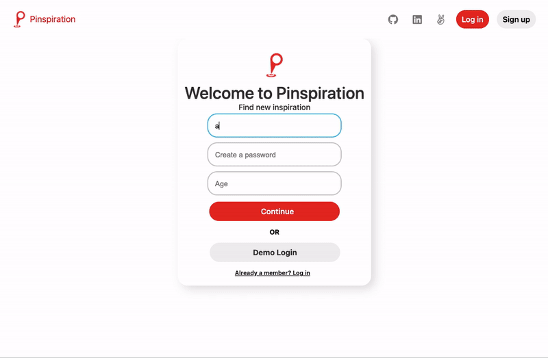

#  Pinspiration

Pinspiration is a single page social networking site inspired by Pinterest. Users to create profiles and boards as well as pin images to boards and browse pins. 

Visit the live site <a href="https://pinspiration.herokuapp.com/#/">here</a>, and find design documents <a href="https://github.com/Anthony-E-Cruz/Pinspiration/wiki">here</a>

## Technologies 

- Ruby on Rails
- React & Redux
- HTML & CSS
- Amazon Web Services S3

## Features

- User Authentication
- Profiles
- Boards
- Pins

## Masonry Layout
- Pins are shuffled and distributed to the appropriate number of columns based on
client screen size. 

## Authentication
- Users have the option of creating an acount, logging in with an existing account or browse as a demo user.

## Profiles
- Users have a profile page with Pins and Boards
- Profile information can be edited 

## Boards
- Users can create new Boards 

## Pins
- Users can Pin images to Boards

